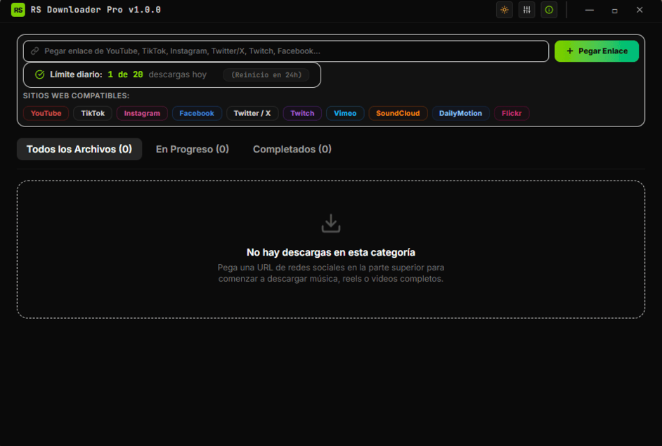

# ⚡ RS Downloader Pro
> **Gestor multimedia premium ultra-rápido, inteligente y multiplataforma.**

<div align="center">

[](https://react.dev)
[](https://vite.dev)
[](https://tailwindcss.com)
[](https://www.typescriptlang.org)
[](https://www.electronjs.org)
[](LICENSE)

</div>

<p align="center">
  
</p>

---

## 📱 Descripción

**RS Downloader Pro** es un gestor de descargas multimedia de altísimo rendimiento diseñado para la era moderna. Permite analizar, extraer y descargar videos, audios y contenido multimedia en resoluciones nativas (hasta **4K / 8K**) de casi cualquier plataforma social de manera local, ágil y sin complicaciones de inicio de sesión. 

Construido sobre una pila híbrida de **React 19 (TypeScript)**, **Tailwind CSS v4**, y un servidor local ligero potenciado por **Express** que sirve de puente hacia motores nativos como **yt-dlp** y **ffmpeg**, la experiencia de usuario ofrece un rendimiento óptimo tanto en navegador web convencional como en entorno de escritorio nativo **Electron** sin bordes.

---

## 📦 Características Destacadas

### 🎨 Experiencia Premium & Responsive
*   **Diseño Unificado (Modo Claro/Oscuro):** Un entorno de diseño minimalista con animaciones sutiles y transiciones de Framer Motion. El dropdown flotante para la acción *"Recordar más tarde"* y el resto de modales se adaptan perfectamente al contraste claro y oscuro.
*   **Single-Source of Truth (Versiones):** La versión de la aplicación se gestiona de manera centralizada en `package.json`. Las capas de actualización de Electron, la documentación interna y el visualizador del cliente importan y consumen el dato en tiempo real ofreciendo coherencia total.

### ⚙️ Automatización e Inteligencia Local
*   **Modo Inteligente (Smart Mode):** Configura tu calidad objetivo y directorio por defecto. Al activar esta opción, cualquier enlace válido pegado comenzará a procesarse y descargarse automáticamente con un solo clic.
*   **Análisis Dinámico de Enlaces:** El sistema desglosa los metadatos completos: autor, título real, miniatura, duración exacta y calcula de antemano el peso aproximado de cada resolución disponible.
*   **Control de Ancho de Banda:** Limita la velocidad de descarga bajo demanda (desde escasos 50 KB/s hasta descarga ilimitada de alta velocidad) para proteger el rendimiento de tu red hogareña.
*   **Fusión Integrada (FFMPEG):** El motor local descarga audio y video por separado de la mejor fuente nativa y los fusiona de manera transparente y sin pérdidas en un archivo final consolidado (.mp4, .mkv).

### 🖥️ Integración de Escritorio Nativa (Electron-Only)
*   **Buscador de Carpetas de Windows:** Interfiere limpiamente con PowerShell para ofrecer un modal nativo de explorador de archivos.
*   **Auto-Updater en Segundo Plano:** El gestor se conecta discretamente con GitHub Releases para notificar, descargar e iniciar actualizaciones automáticas a la última versión disponible del sistema.

---

## 🛠️ Arquitectura y Tecnologías

```
┌────────────────────────────────────────────────────────┐
│             RS Downloader Pro (UI Cliente)             │
│   React 19 + TypeScript + Tailwind v4 + Lucide Icons   │
└───────────────────────────┬────────────────────────────┘
                            │ (API de Control / IPC)
                            ▼
┌────────────────────────────────────────────────────────┐
│             Servidor Local / Electron IPC              │
│       Express API Backend + Hilos de child_process     │
└───────────────────────────┬────────────────────────────┘
                            │ (Ejecución CLI en segundo plano)
                            ▼
┌────────────────────────────────────────────────────────┐
│           Motores de Descarga y Fusión Local           │
│                    yt-dlp + ffmpeg                     │
└────────────────────────────────────────────────────────┘
```

---

## 🚀 Instalación y Guía de Desarrollo

### Requisitos Previos
*   **Node.js** LTS (v18 o superior recomendado, e.g. v20)
*   **npm** (instalado con Node)
*   **Git** & **Git LFS** (Large File Storage)

### 1. Clonar el repositorio y obtener los archivos binarios
El proyecto utiliza Git LFS para poder gestionar de forma ágil los archivos biarios ejecutables de `yt-dlp` y `ffmpeg` correspondientes a cada sistema operativo.

```bash
# Habilitar Git LFS en tu entorno global de Git
git lfs install

# Clonar del repositorio oficial
git clone https://github.com/ROSNLR5/rs-downloader-pro.git
cd rs-downloader-pro

# Forzar la descarga correcta de binarios locales LFS
git lfs pull
```

---

### Opción A: Ejecución en Modo Web (Servidor Local)
Ideal para probar el panel responsive, evaluar API de descargas, o utilizar la aplicación corriendo en tu hosting o navegador nativo.

```bash
# Instalar todos los módulos de desarrollo
npm install

# Iniciar servidor unificado (Express + Middleware Vite)
npm run dev
```
> La aplicación iniciará en la dirección local estándar: **`http://localhost:3000`**

### Opción B: Ejecución en Ventana Nativa de Escritorio (Electron)
Si deseas experimentar la integración offline sin bordes y flujos nativos como controles de ventana de Windows o el autoactualizador simulado:

```bash
# Lanzar el contenedor de escritorio nativo
npm run electron:start
```

---

## 📁 Archivos Binarios Estructurados

La aplicación busca de forma automatizada los binarios requeridos integrados en la carpeta `/bin` de la raíz del proyecto. Estos deben estar configurados de la siguiente forma según la plataforma:

```txt
rs-downloader-pro/
├── bin/
│   ├── yt-dlp.exe    <-- Motor de extracción (Windows)
│   ├── yt-dlp        <-- Motor de extracción (macOS / Linux)
│   ├── ffmpeg.exe    <-- Herramienta de postprocesamiento de fusión (Windows)
│   └── ffmpeg        <-- Herramienta de postprocesamiento de fusión (macOS / Linux)
```

> **Importante para distribuciones basadas en Unix (macOS / Linux):** Ofrece permisos de ejecución correctos a estos archivos para habilitar la descarga usando la terminal:
> ```bash
> chmod +x bin/yt-dlp bin/ffmpeg
> ```

---

## 📦 Compilación y Distribución para Producción

Para generar un instalador de escritorio autónomo, optimizado y listo para distribuir en sistemas operativos de escritorio, la aplicación integra scripts de compilación basados en **electron-builder** y bundle server de **esbuild**:

```bash
# Compila los assets de React, empaqueta el backend moderno y genera el archivo .EXE en Windows
npm run electron:build
```

El resultado se almacenará de manera automatizada en la carpeta:
*   📁 **`dist-electron/`** (Donde encontrarás el instalador autónomo `.exe` de tu aplicación).

---

## 📝 Resolviendo Conflictos Comunes (Troubleshooting)

### ⚠️ ¿Por qué las descargas fallan o dicen "No se encuentra el módulo ffmpeg"?
Asegúrate de que completaste los pasos de Git LFS. Si los ejecutables pesan solo unos bytes de texto (archivos puntero de LFS), la simulación fallará. Ejecuta `git lfs pull` para descargar los archivos correspondientes a los punteros.

### ⚠️ Adaptabilidad de Temas
Todos los cuadros de diálogos, selectores e indicadores han sido validados con la paleta de colores nativa de Tailwind v4 y variables CSS dinámicas para asegurar lecturas legibles en entornos con iluminación diurna o nocturna.

---

## 👨‍💻 Autor y Colaboradores

*   **Ing. Rosmer Santaella** (**ROSNLR5**) - *Idea original y desarrollo principal* - [@ROSNLR5](https://github.com/ROSNLR5)

---

## 📄 Licencia

Este gestor premium se distribuye bajo los términos del software libre con la **Licencia MIT**. Consulta las pautas pertinentes dentro del repositorio de origen.
